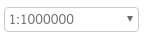
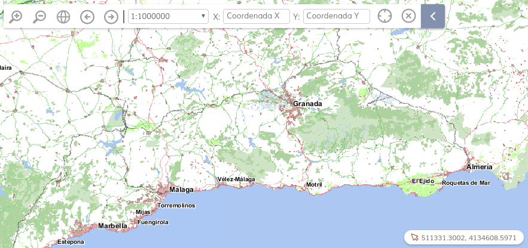

# history-navigation

[](https://github.com/sigcorporativo-ja/Mapea4-dev)  

## Descripción

Plugin para [Mapea](https://github.com/sigcorporativo-ja/Mapea4) desarrollado por la Consejería de Medioambiente y Ordenación del Territorio de la Junta de Andalucía. Crea un panel propio que contiene los siguientes controles:  
* Acercarse y alejarse  
* Zoom a la extensión del mapa  
* Historial de navegación (anterior/posterior)  
* (Opcional) Selector desplegable de escala  
* (Opcional) Zoom a coordenada 

Además, el panel del plugin acepta otros controles que sean compatibles a nivel de diseño, y que pueden añadirse a través de un parámetro adicional en el constructor.  



## Recursos y uso

- js: navigation.ol.js
- css: navigation.min.css

Parámetro | Descripción 
--- | --- |
**controls** | Array<M.control> - controles adicionales opcionales compatibles  
**options** | {object} - Opciones de plugin:<br>**scaleCtl** - {boolean} - incluir selector de escala <br>**scaleConfig** - Array\<number\> - escalas del selector<br>**coordinatesCtl** - {boolean} - incluir zoom a la coordenada  

Ejemplo:
```javascript
// Configuración de las escalas
var scaleConfig = {
    'scales': [10000, 25000, 50000, 100000, 150000, 250000, 500000, 1000000]
};
            
var control = new M.control.Mouse();
var navigationPlugin = new M.plugin.Navigation({
	controls: [/*controles adicionales compatibles*/],
	options: {
		scaleCtl: true, // Incluir selector de escala
		scaleConfig: scaleConfig, // Escalas del selector
        coordinatesCtl: true, // Incluir zoom a coordenada
		
	}
});
myMap.addPlugin(navigationPlugin);   
```
